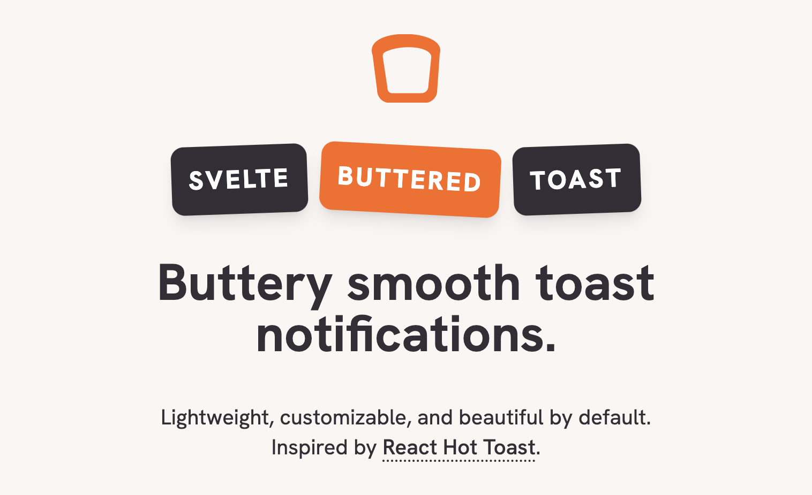

<p align="center">


</p>
<p align="center">
<a href="https://svelte-french-toast.vercel.app">Website</a> · <a href="https://npmjs.com/package/svelte-french-toast">NPM Package</a>
</p>

# svelte-french-toast

> Buttery smooth Svelte notifications.

svelte-french-toast is a Svelte port of Timo Lins’s react-hot-toast, a lightweight, customizable, and beautiful-by-default toast notification library.

## Installation

Install the package with your favorite package manager:

```
npm install svelte-french-toast
```

```
pnpm install svelte-french-toast
```

```
yarn add svelte-french-toast
```

## Basic usage

Mount a `<Toaster />` at the top level of your app and use the `toast` API to display toasts.

```js
<script>
	import toast, {Toaster} from 'svelte-french-toast'

	function handleClick() {
		toast.success('Hello, world!')
	}
</script>

<Toaster />
<button type="button" on:click={handleClick}>Toast</button>
```

For more usage examples, see [the website](https://svelte-french-toast.vercel.app).

## Thanks

Thanks to the original author of React Hot Toast and its contributors.

```
MIT License

Copyright (c) 2020 Timo Lins

Permission is hereby granted, free of charge, to any person obtaining a copy
of this software and associated documentation files (the "Software"), to deal
in the Software without restriction, including without limitation the rights
to use, copy, modify, merge, publish, distribute, sublicense, and/or sell
copies of the Software, and to permit persons to whom the Software is
furnished to do so, subject to the following conditions:

The above copyright notice and this permission notice shall be included in all
copies or substantial portions of the Software.

THE SOFTWARE IS PROVIDED "AS IS", WITHOUT WARRANTY OF ANY KIND, EXPRESS OR
IMPLIED, INCLUDING BUT NOT LIMITED TO THE WARRANTIES OF MERCHANTABILITY,
FITNESS FOR A PARTICULAR PURPOSE AND NONINFRINGEMENT. IN NO EVENT SHALL THE
AUTHORS OR COPYRIGHT HOLDERS BE LIABLE FOR ANY CLAIM, DAMAGES OR OTHER
LIABILITY, WHETHER IN AN ACTION OF CONTRACT, TORT OR OTHERWISE, ARISING FROM,
OUT OF OR IN CONNECTION WITH THE SOFTWARE OR THE USE OR OTHER DEALINGS IN THE
SOFTWARE.
```
