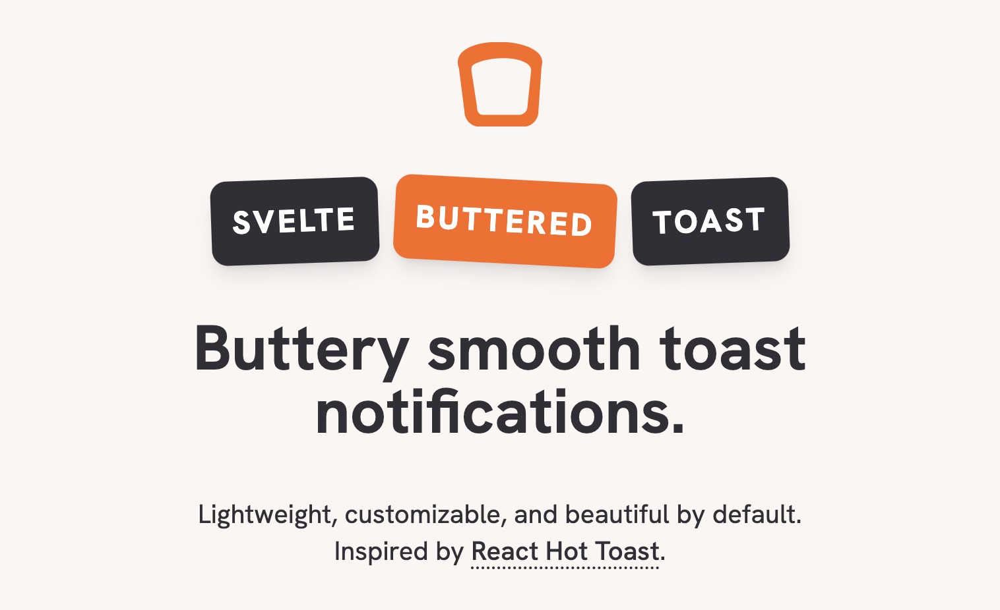

# svelte-french-toast



[](https://www.npmjs.com/package/svelte-french-toast)
[](LICENSE.md)
[](https://svelte-french-toast.vercel.app)

> Buttery smooth Svelte notifications.

**svelte-french-toast** is a Svelte port of Timo Lins’s [react-hot-toast](https://react-hot-toast.com), a lightweight, customizable, and beautiful-by-default toast notification library.

---

## ⚡ Installation

Install using your preferred package manager:

```bash
npm install svelte-french-toast
# or
pnpm add svelte-french-toast
# or
yarn add svelte-french-toast
# or
bun add svelte-french-toast
```

---

## 🎨 Basic Usage

Mount the `<Toaster />` component at the top level of your app:

```svelte
<script lang="ts">
	import { toast, Toaster } from 'svelte-french-toast';
</script>

<Toaster />
```

Trigger notifications:

```ts
toast.success('Task completed!');
toast.error('Something went wrong!');
toast('Hello world!');
```

> **Critical:** Import the CSS in your root layout to make it look buttery smooth:
>
> ```ts
> import 'svelte-french-toast/css/index.css';
> ```

---

## 🌐 Examples

For more usage and demos, see [the website](https://svelte-french-toast.vercel.app).

---

## 🙏 Thanks

Thanks to the original author of React Hot Toast and all contributors.

---

## 📝 License

MIT License © 2020 Timo Lins

Permission is hereby granted, free of charge, to any person obtaining a copy of this software and associated documentation files (the "Software"), to deal in the Software without restriction, including without limitation the rights to use, copy, modify, merge, publish, distribute, sublicense, and/or sell copies of the Software, and to permit persons to whom the Software is furnished to do so, subject to the following conditions:

The above copyright notice and this permission notice shall be included in all copies or substantial portions of the Software.

THE SOFTWARE IS PROVIDED "AS IS", WITHOUT WARRANTY OF ANY KIND, EXPRESS OR IMPLIED, INCLUDING BUT NOT LIMITED TO THE WARRANTIES OF MERCHANTABILITY, FITNESS FOR A PARTICULAR PURPOSE AND NONINFRINGEMENT. IN NO EVENT SHALL THE AUTHORS OR COPYRIGHT HOLDERS BE LIABLE FOR ANY CLAIM, DAMAGES OR OTHER LIABILITY, WHETHER IN AN ACTION OF CONTRACT, TORT OR OTHERWISE, ARISING FROM, OUT OF OR IN CONNECTION WITH THE SOFTWARE OR THE USE OR OTHER DEALINGS IN THE SOFTWARE.
